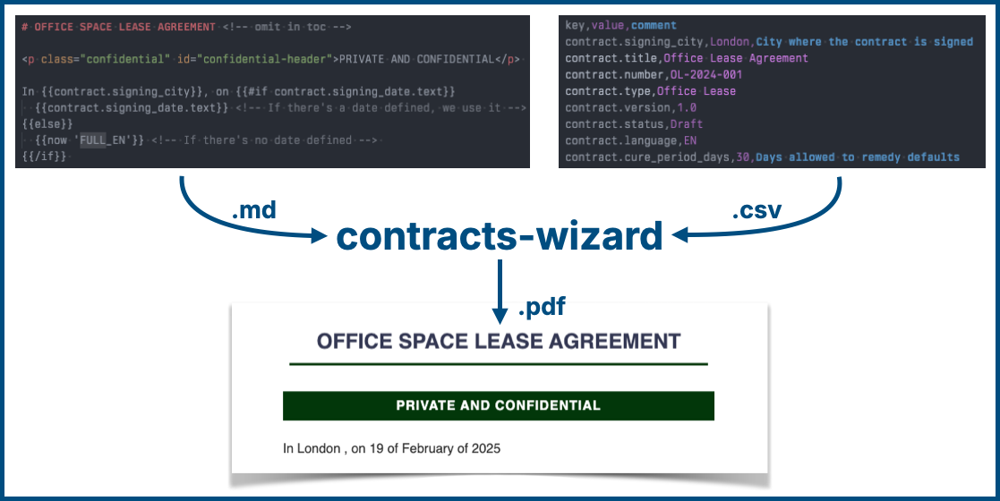

# Contracts Wizard <!-- omit in toc -->

A powerful document generation system that transforms Markdown templates and CSV data into professionally formatted contracts. Perfect for legal teams, freelancers, and businesses looking to streamline their document generation workflow.



[](https://opensource.org/licenses/MIT)
[](https://nodejs.org/)
[](https://github.com/Shopify/eslint-plugin-shopify)
[](http://makeapullrequest.com)
[](https://github.com/dwyl/esta/issues)

## Table of Contents <!-- omit in toc -->

- [✨ Features](#-features)
  - [Core Features](#core-features)
  - [Advanced Features](#advanced-features)
- [🚀 Quick Start](#-quick-start)
- [📝 Example Files](#-example-files)
- [📖 Installation](#-installation)
  - [1. Global Installation (Recommended for users)](#1-global-installation-recommended-for-users)
  - [2. Local Installation (For development)](#2-local-installation-for-development)
  - [Prerequisites](#prerequisites)
  - [System Requirements](#system-requirements)
- [📖 Usage](#-usage)
  - [CLI Mode](#cli-mode)
  - [Interactive Mode](#interactive-mode)
  - [Command Line Options](#command-line-options)
- [📚 Documentation](#-documentation)
- [🔄 Program Flow](#-program-flow)
- [🤝 Contributing](#-contributing)
- [📜 License](#-license)
- [🙏 Acknowledgments](#-acknowledgments)
- [📦 Release Process](#-release-process)
- [🔍 Troubleshooting](#-troubleshooting)
  - [Common Issues](#common-issues)
  - [Debug Mode](#debug-mode)
  - [File Naming](#file-naming)

## ✨ Features

### Core Features

- **Template Processing**: Support for Markdown templates with Handlebars syntax
- **Multiple Output Formats**: Generate HTML and PDF documents with customizable styling
- **Interactive CLI**: User-friendly command-line interface with guided prompts
- **Data Management**: CSV-based data storage with validation and manual input options
- **Custom Styling**: Apply CSS styling to your documents with built-in responsive design
- **Date Handling**: Comprehensive date formatting and manipulation with full Spanish locale support and timezone configuration
- **Robust Logging**: Comprehensive logging system with rotation and debug support
- **Internal Links**: Automatic generation of clickable links in PDF table of contents that navigate to corresponding sections

### Advanced Features

- **Nested Fields**: Support for complex data structures using dot notation
- **Custom Helpers**: Built-in Handlebars helpers for common operations
- **Responsive Tables**: Automatic table wrapping for better mobile display
- **Accessibility**: Built-in image accessibility improvements
- **Missing Data Highlighting**: Visual indicators for missing or empty values
- **Error Recovery**: Graceful handling of missing files and invalid data
- **Extensible Design**: Easy to add new template helpers and output formats

## 🚀 Quick Start

1. Install globally:

   ```bash
   npm install -g @petalo/contracts-wizard
   ```

2. Create a new project:

   ```bash
   contracts-wizard init my-contracts
   cd my-contracts
   ```

3. Create and edit the `.env` file with your desired settings:

   ```bash
   cp .env.example .env
   ```

4. Run the setup script:

   ```bash
   npm run setup
   ```

5. Start using the wizard:

   ```bash
   contracts-wizard
   ```

## 📝 Example Files

The package includes example files in the `examples/` directory to help you get started:

- `office_lease_EN.example.md` - Example lease contract template
- `office_lease_EN.example.csv` - Example data for the lease contract (some values have been deleted or left empty to show the missing data highlighting)
- `contract.example.css` - Example CSS styling

These files are for reference only. To use them in your project, either:

- Run `npm run setup` to copy them to your working directories
- Create a new project with `contracts-wizard init` which will copy them automatically

The working directories for your files (by default) are:

- Templates → `templates/markdown/`
- CSS files → `templates/css/`
- CSV files → `data-csv/`

## 📖 Installation

There are two ways to install Contracts Wizard:

### 1. Global Installation (Recommended for users)

If you just want to use the tool to generate contracts:

```bash
# Install globally
npm install -g contracts-wizard

# Create a new project
contracts-wizard init my-contracts
cd my-contracts

# Copy the .env.example file and edit it with your desired settings
cp .env.example .env

# Start using
contracts-wizard
```

This installation:

- Provides the `contracts-wizard` command globally
- Creates a clean project structure
- Includes basic templates and examples

### 2. Local Installation (For development)

If you want to contribute to the project or customize it:

```bash
# Clone the repository
git clone https://github.com/petalo/contracts-wizard.git
cd contracts-wizard

# Install dependencies
npm install

# Configure the project
npm run setup

# Start in development mode
npm run dev
```

This installation:

- Provides full access to the source code
- Includes development tools
- Allows contributing to the project

### Prerequisites

Before installing Contracts Wizard, ensure you have:

- **Node.js**: >= 14.0.0

  ```bash
  node --version
  ```

- **npm**: >= 6.0.0

  ```bash
  npm --version
  ```

- **Git**: Latest version (for development)

  ```bash
  git --version
  ```

- **Memory**: Minimum 1GB RAM available
- **Disk Space**: At least 100MB free space
- **Operating System**: Windows 10+, macOS 10.15+, or Linux (Ubuntu 18.04+)

### System Requirements

- **CPU**: 1GHz or faster
- **Network**: Internet connection for initial setup
- **Browser**: For PDF preview (if needed)
  - Chrome/Chromium >= 85
  - Firefox >= 80

## 📖 Usage

### CLI Mode

Basic usage with examples:

```bash
# Generate contract from template and CSV
contracts-wizard generate -t contract.md -d input.csv

# Use custom styling
contracts-wizard generate -t contract.md -d input.csv -c style.css

# Use custom styling and highlight missing and imported values
contracts-wizard generate -t contract.md -d input.csv -c style.css --highlight

# Add a suffix to the generated filenames
contracts-wizard generate -t contract.md -d input.csv -c style.css --suffix client_name

# List available resources
contracts-wizard list templates
contracts-wizard list data
contracts-wizard list styles

# Get help
contracts-wizard --help
```

### Interactive Mode

The interactive mode guides you through the process:

```bash
# Start the wizard with no arguments
contracts-wizard
```

### Command Line Options

Options for the `generate` command:

| Option      | Short | Description                       | Example              |
| ----------- | ----- | --------------------------------- | -------------------- |
| --template  | -t    | Template file path                | -t contract.md       |
| --data      | -d    | CSV data file path                | -d input.csv         |
| --css       | -c    | CSS style file path               | -c style.css         |
| --output    | -o    | Output directory path             | -o ./output          |
| --suffix    |       | Add suffix to generated filenames | --suffix client_name |
| --highlight |       | Enable highlighting styles        | --highlight          |

Global options:

| Option    | Description                                | Example   |
| --------- | ------------------------------------------ | --------- |
| --help    | Show help                                  | --help    |
| --version | Show version                               | --version |
| --verbose | Enable verbose output (same as DEBUG=true) | --verbose |

## 📚 Documentation

The project includes several documentation files:

- [HANDLEBARS.md](documentation/HANDLEBARS.md) - Comprehensive guide to all available Handlebars helpers
- [CONTRACTS_GENERATION.md](documentation/CONTRACTS_GENERATION.md) - Best practices and tips for contract generation
- [CONTRIBUTING.md](CONTRIBUTING.md) - Guidelines for contributing to the project
- [LICENSE](LICENSE) - MIT license details

## 🔄 Program Flow

1. **Template Processing**
   - Load Markdown template
   - Parse Handlebars syntax
   - Apply data from CSV

2. **Data Management**
   - Load CSV data
   - Validate required fields
   - Handle missing values

3. **Style Application**
   - Apply CSS styling
   - Handle responsive design
   - Format tables and lists

4. **Output Generation**
   - Generate HTML output
   - Create PDF version
   - Save to output directory

## 🤝 Contributing

We welcome contributions! Please see our [Contributing Guide](CONTRIBUTING.md) for details.

## 📜 License

This project is licensed under the MIT License - see the [LICENSE](LICENSE) file for details.

## 📦 Release Process

See [CONTRIBUTING.md](CONTRIBUTING.md) for release process details.

## 🔍 Troubleshooting

### Common Issues

1. **Installation Fails**

   ```bash
   # Clear npm cache
   npm cache clean --force
   # Retry installation
   npm install -g @petalo/contracts-wizard
   ```

2. **PDF Generation Fails**
   - Check Chrome/Chromium installation
   - Verify sufficient memory available
   - Check file permissions in output directory

3. **Missing Data Handling**
   - Verify CSV format matches template fields
   - Check for proper UTF-8 encoding
   - Validate date formats match locale settings

4. **Template Processing Issues**
   - Validate Handlebars syntax
   - Check for proper closing tags
   - Verify helper function usage

### Debug Mode

Enable debug mode for detailed logging:

```bash
DEBUG=true contracts-wizard generate -t template.md
```

Check logs at `logs/latest.log` for detailed error information.

### File Naming

By default, generated files follow this pattern:

```text
template.{md,html,pdf}
```

When files already exist, a revision number is added:

```text
template.rev.1.{md,html,pdf}
```

You can add a custom suffix to the filenames using the `--suffix` option:

```text
template.suffix.{md,html,pdf}
```

And with revisions:

```text
template.rev.1.suffix.{md,html,pdf}
```

This is particularly useful when generating multiple versions of the same template for different clients or purposes:

```bash
# Generate English version
contracts-wizard generate -t contract.md -d data_en.csv --suffix EN

# Generate Spanish version
contracts-wizard generate -t contract.md -d data_es.csv --suffix ES

# Generate client-specific version
contracts-wizard generate -t contract.md -d client_data.csv --suffix ClientName
```

The suffix will be added to all generated files (Markdown, HTML, and PDF) just before the file extension
