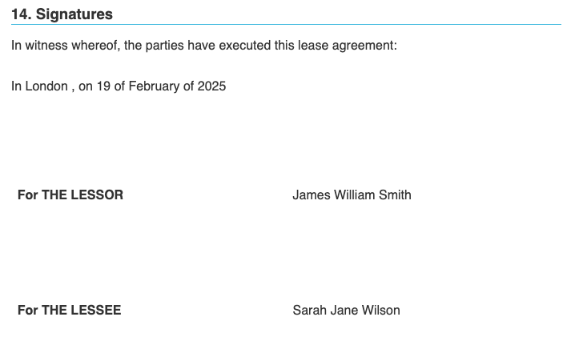

<!-- markdownlint-disable MD029 -->
# Contract Generation Guide <!-- omit in toc -->

Tis guide provides best practices and tips for generating professional contracts using Contracts Wizard.

## Table of Contents <!-- omit in toc -->

- [Template Structure](#template-structure)
  - [Header Section](#header-section)
  - [Recitals Section](#recitals-section)
  - [Clauses Section](#clauses-section)
  - [Signature Block](#signature-block)
- [Data Organization](#data-organization)
  - [CSV Structure](#csv-structure)
- [Common Patterns](#common-patterns)
  - [1. Conditional Clauses](#1-conditional-clauses)
  - [2. Repeating Elements](#2-repeating-elements)
  - [3. Nested Data](#3-nested-data)
  - [4. Calculations](#4-calculations)
- [Troubleshooting](#troubleshooting)
  - [Common Issues](#common-issues)
  - [Debug Tips](#debug-tips)
  - [Error Messages](#error-messages)

## Template Structure

In this document we will assume that you will be generating your contracts using the CSS file `contract.example.css` that you can find in the css directory defined in your `.env` file.

### Header Section

We recommend you to start your contract using the following header:

```markdown


# OFFICE SPACE LEASE AGREEMENT <!-- omit in toc -->

<p class="confidential" id="confidential-header">PRIVATE AND CONFIDENTIAL</p> 

In {{contract.signing_city}}, on {{#if contract.signing_date.text}}
  {{contract.signing_date.text}} <!-- If there's a date defined, we use it -->
{{else}}
  {{now 'FULL_EN'}} <!-- If there's no date defined --> 
{{/if}} 


```

If the `contract.signing_city` field is defined in the CSV as "London", the generated HTML with the applied CSS will output something like this:


### Recitals Section

If you want to add a recitals section to your contract, wrap it with the `recitals` CSS class. This class is now empty, but you can add your own styles to it in the `contract.example.css` file.

```markdown
## Background

<div class="recitals">
WHEREAS:

1. {{recital1}}
2. {{recital2}}
3. {{recital3}}
</div>

NOW, THEREFORE, the parties agree as follows:
```

### Clauses Section

Organize clauses hierarchically:

```markdown
## 1. Definitions

1.1. "Agreement" means {{agreement_definition}}
1.2. "Services" means {{services_definition}}

## 2. Term

2.1. This Agreement shall commence on {{formatDate start_date "FULL"}} and continue until {{formatDate end_date "FULL"}}.
```

### Signature Block

End with a clear signature section. The `signatures` CSS class will apply enough space to fill in with handwritten signatures, stamps or digital certificates.

```html
    <h2>14. Signatures</h2>
      <p>In witness whereof, the parties have executed this lease agreement:</p>
         <div class="signatures">

In {{contract.signing_city}}, on {{contract.signing_date}}In {{contract.signing_city}}, on {{#if contract.signing_date.text}} <!-- We check if there's a date defined in the "contract.signing_date.text" field of the CSV file -->
  {{contract.signing_date.text}} <!-- If there's a date defined, we use it -->
{{else}}
  {{now 'FULL_EN'}} <!-- If there's no date defined, we use the current date -->
{{/if}}

| Party              | Signatory                          |
| ------------------ | ---------------------------------- |
| **For THE LESSOR** | {{lessor.representative.fullName}} |
| **For THE LESSEE** | {{lessee.representative.fullName}} |

      </div>
```

This will output something like this:



## Data Organization

### CSV Structure

Organize your CSV data logically.

We recommend you to:

- Use snake_case for keys
- Group related fields with dot notation
- Use the hashtag symbol (`#`) to add comments to the CSV
- Add a comment as the 3rd column to explain how the key should be interpreted
- Wrap the value in double quotes if it contains commas

```csv
key,value,comment
#
# CONTRACT RELATED FIELDS
#
contract.signing_city,London,The city where the contract will be signed
contract.signing_date.text,2025-02-19,The date of the contract signing
#
# PARTY RELATED FIELDS
#
party1.details.name,Acme Corporation, Full legal name of the party
party1.details.address,"123 Main St,15th floor, London, EC1A 1BB, United Kingdom",Physical address of the party (with zip and country)
party1.contact.email,john@acme.com
party1.contact.phone,+1234567890,With country code stripped of any spaces or special characters
```

## Common Patterns

### 1. Conditional Clauses

You can check if a field is defined in the CSV file by using the `if` helper. This check can also be more complex by using the `and` and `or` helpers.

```handlebars
{{#if (or include_confidentiality include_non_disclosure)}}
## Confidentiality

{{confidentiality_clause}}
{{/if}}
```

Also, you can use the `else` helper to provide an alternative clause if the condition is not met.

```handlebars
{{#if (and include_confidentiality include_non_disclosure)}}
## Confidentiality
{{confidentiality_clause}}
   {{else}}
## Non-Disclosure
{{non_disclosure_clause}}
{{/if}}
```

It's recommended to use the `highlight` CSS class to visually identify the conditional clause in the generated HTML. This class will be applied when running the `contracts-wizard` command with the `--highlight` flag.

```handlebars
<div class="highlight">
{{#if (and include_confidentiality include_non_disclosure)}}

## Confidentiality
{{confidentiality_clause}}
{{/if}}
<div class="highlight">
```

### 2. Repeating Elements

```handlebars
## Schedule A - Deliverables

{{#each deliverables}}
{{@index}}. {{description}}
   Price: {{formatCurrency price currency="EUR"}}
{{/each}}
```

### 3. Nested Data

```handlebars
## Contact Information

{{#with contact}}
Name: {{first_name}} {{last_name}}
Email: {{formatEmail email}}
Phone: {{phone}}
{{/with}}
```

### 4. Calculations

```handlebars
## Payment Summary

Subtotal: {{formatCurrency subtotal currency="EUR"}}
Tax (21%): {{formatCurrency (multiply subtotal 0.21) currency="EUR"}}
Total: {{formatCurrency (add subtotal (multiply subtotal 0.21)) currency="EUR"}}
```

## Troubleshooting

Remember that apart from HTML comments (`<!-- -->`), you can use Handlebars comments (`{{! }}`) to add comments to the template.

```handlebars
{{! Section for payment terms }}
## 3. Payment Terms

{{! Calculate total with tax }}
{{formatCurrency (multiply amount 1.21) currency="EUR"}}
```

### Common Issues

1. **Missing Values**
   - Check CSV file format
   - Verify key names match template
   - Use default values where appropriate

2. **Formatting Issues**
   - Verify CSS is properly linked
   - Check for conflicting styles
   - Use browser inspector to debug
   - Execute the `npm run test:smoke:helpers` command to check if the helpers are working as expected

3. **Layout Problems**
   - Use appropriate page breaks
   - Check margin settings
   - Verify table layouts
   - The output PDF settings can be found in the `src/config/pdf-options.js` file

### Debug Tips

1. **Enable Debug Mode**

Run the `contracts-wizard` command with the `--debug` flag to enable debug mode. This will output the intermediate HTML output to the console.

   ```bash
   DEBUG=true contracts-wizard generate -t template.md -d data.csv
   ```

Optionally, you can also check the latest execution log in the `logs/latest.log` file. Check your `.env` file to see the log level set and the file path.

2. **Check Generated HTML**
   - Review intermediate HTML output
   - Verify helper output format
   - Check for malformed markup with a validator like [W3C Markup Validation Service](https://validator.w3.org/)
   - Enclose the debugged parts inside a `highlight` class and Add the `--highlight` flag to the `contracts-wizard` command to highlight those parts.

### Error Messages

Common error messages and solutions:

1. **"Invalid date format"**
   - Ensure dates in CSV use ISO format (YYYY-MM-DD) to be interpreted as a date type
   - Check date helper format string

2. **"Missing required field"**
   - Verify all required fields exist in CSV
   - Add conditional logic for optional fields

3. **"Invalid currency value"**
   - Check number format in CSV
   - Verify currency code is supported
