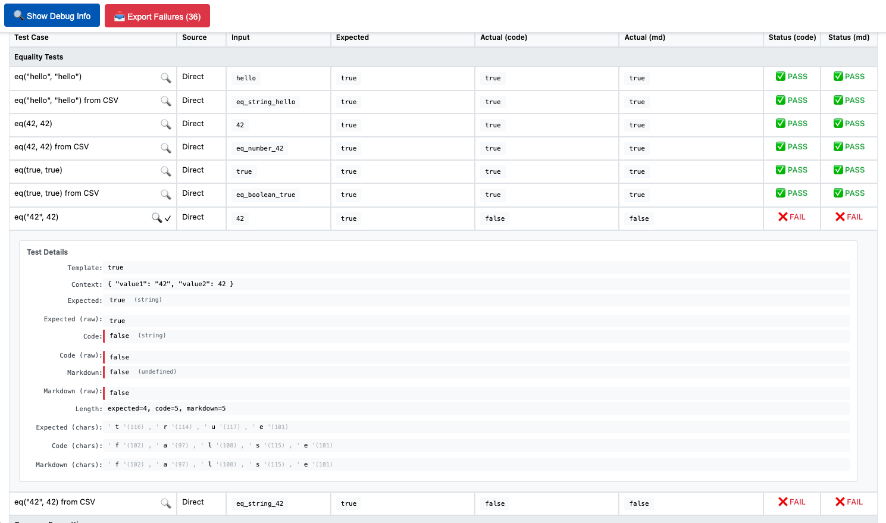

# Handlebars Helpers Guide <!-- omit in toc -->

This document provides a comprehensive guide to the Handlebars helpers available in Contracts Wizard.

- [Testing the Helpers](#testing-the-helpers)
  - [Understanding the Test Results](#understanding-the-test-results)
- [Date Helpers](#date-helpers)
  - [now](#now)
  - [formatDate](#formatdate)
  - [addYears](#addyears)
- [Currency Helpers](#currency-helpers)
  - [formatCurrency](#formatcurrency)
  - [currencySymbol](#currencysymbol)
- [Number Helpers](#number-helpers)
  - [formatNumber](#formatnumber)
- [Logic Helpers](#logic-helpers)
  - [if](#if)
  - [eq](#eq)
  - [and](#and)
  - [not](#not)
- [Array Helpers](#array-helpers)
  - [each](#each)
- [Value Helpers](#value-helpers)
  - [formatEmail](#formatemail)
  - [formatString](#formatstring)
- [Debug Helpers](#debug-helpers)
  - [log](#log)
  - [lookup](#lookup)
- [Internal Helpers](#internal-helpers)
  - [blockHelperMissing](#blockhelpermissing)
  - [objectToArray](#objecttoarray)
- [Error Handling](#error-handling)
- [HTML Output](#html-output)
- [Best Practices](#best-practices)

## Testing the Helpers

To see all helpers in action and verify their behavior, you can use our visual testing tool:

```bash
npm run test:smoke:helpers
```

This command will:

1. Run all test cases for each helper
2. Generate a visual test report in HTML format
3. Open your default browser to show the results

The test report will show:

- Each helper's functionality with real examples
- Expected vs actual output for each test case
- Both direct library output and markdown processing output
- Visual indicators for passed/failed tests
- Detailed debug information when needed

You can find the test report at `tests/__common__/handlebars-helpers/output/test-results.html`



### Understanding the Test Results

The test report includes:

- **Test Case**: Description of what's being tested
- **Source**: Whether the test is direct or from CSV data
- **Input**: The raw input value
- **Expected**: What the helper should output
- **Actual (code)**: What the helper actually outputs
- **Actual (md)**: What the markdown processor outputs
- **Status**: Whether the test passed or failed

You can click on any test case to see detailed debug information, including:

- Exact character comparisons
- Type information
- Raw values
- Context data

Also, you can download a list of all the failed tests just clicking on the `📥 Export Failures` button.

## Date Helpers

- [now](#now) - Get current date in specified format
- [formatDate](#formatdate) - Format dates with various predefined formats
- [addYears](#addyears) - Add or subtract years from a date

You can check the full list of date formats in the [Handlebars Config](../src/config/handlebars-config.js) file.

### now

Returns the current date in the specified format.

```handlebars
{{now format}}
```

**Parameters:**

- `format`: (optional) The format to use (same as formatDate)

**Examples:**

```handlebars
{{now}}
<!-- Output: <span class="imported-value" data-field="date">29/01/2024</span> -->

{{now "FULL"}}
<!-- Output: <span class="imported-value" data-field="date">29 de enero de 2024</span> -->
```

### formatDate

Formats a date according to the specified format and locale.

```handlebars
{{formatDate value "DEFAULT"}}
{{formatDate value "ISO"}}
{{formatDate value "FULL"}}
```

**Parameters:**

- `value`: The date to format (string, Date object, or ISO string)
- `format`: (optional) The format to use. Available formats:
  - `DEFAULT`: "dd/MM/yyyy" (e.g., "29/01/2024")
  - `ISO`: "yyyy-MM-dd" (e.g., "2024-01-29")
  - `FULL`: "d 'de' MMMM 'de' yyyy" (e.g., "29 de enero de 2024")
  - `ISO8601`: "yyyy-MM-dd HH:mm:ss" (e.g., "2024-01-29 13:45:30")
  - `TIME`: "HH:mm:ss" (e.g., "13:45:30")

**Examples:**

```handlebars
{{formatDate "2024-01-29"}}
<!-- Output: <span class="imported-value" data-field="date">29/01/2024</span> -->

{{formatDate "2024-01-29" "FULL"}}
<!-- Output: <span class="imported-value" data-field="date">29 de enero de 2024</span> -->
```

### addYears

Adds a specified number of years to a date.

```handlebars
{{addYears value years}}
```

**Parameters:**

- `value`: The base date
- `years`: Number of years to add (can be negative)

**Examples:**

```handlebars
{{addYears "2024-01-29" 1}}
<!-- Output: <span class="imported-value" data-field="date">29/01/2025</span> -->

{{addYears "2024-02-29" 1}}
<!-- Output: <span class="imported-value" data-field="date">28/02/2025</span> -->
```

## Currency Helpers

- [formatCurrency](#formatcurrency) - Format numbers as currency with symbols
- [currencySymbol](#currencysymbol) - Get currency symbol for a given currency code

### formatCurrency

Formats a number as currency with proper locale and symbol.

```handlebars
{{formatCurrency value options}}
```

**Parameters:**

- `value`: The number to format
- `options`:
  - `currency`: Currency code (e.g., 'EUR', 'USD', 'GBP')
  - `minDecimals`: Minimum decimal places
  - `maxDecimals`: Maximum decimal places
  - `useCode`: Use currency code instead of symbol

**Examples:**

```handlebars
{{formatCurrency 1000 currency="EUR"}}
<!-- Output: <span class="imported-value" data-field="currency">1.000,00 €</span> -->

{{formatCurrency 1234.56 currency="USD"}}
<!-- Output: <span class="imported-value" data-field="currency">$1,234.56</span> -->

{{formatCurrency 1000.5 currency="USD" maxDecimals=0}}
<!-- Output: <span class="imported-value" data-field="currency">$1,001</span> -->
```

### currencySymbol

Gets the symbol for a currency code.

```handlebars
{{currencySymbol code}}
```

**Parameters:**

- `code`: Currency code (e.g., 'EUR', 'USD', 'GBP')

**Examples:**

```handlebars
{{currencySymbol "EUR"}} <!-- Output: € -->
{{currencySymbol "USD"}} <!-- Output: $ -->
{{currencySymbol "GBP"}} <!-- Output: £ -->
```

## Number Helpers

- [formatNumber](#formatnumber) - Format numbers with locale-specific formatting

### formatNumber

Formats a number according to locale and specified options.

```handlebars
{{formatNumber value options}}
```

**Parameters:**

- `value`: The number to format
- `options`:
  - `style`: Format style ('decimal', 'percent')
  - `minDecimals`: Minimum decimal places
  - `maxDecimals`: Maximum decimal places
  - `useGrouping`: Use thousand separators

**Examples:**

```handlebars
{{formatNumber 1234.56}}
<!-- Output: <span class="imported-value" data-field="number">1.234,56</span> -->

{{formatNumber 0.5 style="percent"}}
<!-- Output: <span class="imported-value" data-field="number">50%</span> -->
```

## Logic Helpers

- [if](#if) - Conditional branching
- [eq](#eq) - Equality comparison
- [and](#and) - Logical AND operation
- [not](#not) - Logical NOT operation

### if

Conditional block helper.

```handlebars
{{#if value}}
  content
{{else}}
  alternative
{{/if}}
```

**Examples:**

```handlebars
{{#if user.isAdmin}}
  Admin content
{{else}}
  User content
{{/if}}
```

### eq

Equality comparison helper.

```handlebars
{{#eq value1 value2}}
  content
{{else}}
  alternative
{{/eq}}
```

**Examples:**

```handlebars
{{#eq type "admin"}}
  Admin panel
{{else}}
  User panel
{{/eq}}
```

### and

Logical AND operation.

```handlebars
{{#and condition1 condition2}}
  content
{{/and}}
```

**Examples:**

```handlebars
{{#and user.isAdmin user.hasPermission}}
  Admin with permission
{{/and}}
```

### not

Logical NOT operation.

```handlebars
{{#not value}}
  content
{{/not}}
```

**Examples:**

```handlebars
{{#not user.isBlocked}}
  Active user content
{{/not}}
```

## Array Helpers

- [each](#each) - Iterate over arrays and objects

### each

Iterates over an array or object.

```handlebars
{{#each array}}
  content
{{else}}
  empty case
{{/each}}
```

**Special Variables:**

- `@index`: Current index
- `@first`: True if first iteration
- `@last`: True if last iteration
- `@key`: Current key (for objects)

**Examples:**

```handlebars
{{#each items}}
  {{@index}}: {{this}}
{{/each}}

{{#each items}}
  {{#if @first}}First: {{/if}}
  {{this}}
  {{#if @last}}Last!{{/if}}
{{/each}}
```

## Value Helpers

- [formatEmail](#formatemail) - Format email addresses

### formatEmail

Formats an email address with proper HTML markup.

```handlebars
{{formatEmail value}}
```

**Examples:**

```handlebars
{{formatEmail "user@example.com"}}
<!-- Output: <span class="imported-value" data-field="email">user@example.com</span> -->
```

### formatString

Formats a string with various text transformations such as capitalization, case conversion, and whitespace handling.

```handlebars {{formatString value options}} ```

Parameters:

- `value`: The string to format
- `options`:
  - `capitalize`: Capitalize first letter of the string
  - `upper`: Convert string to uppercase
  - `lower`: Convert string to lowercase
  - `trim`: Trim whitespace from start and end
  - `field`: Custom data field name for the output

Examples:

```handlebars
{{formatString "hello world" capitalize=true}}
<!-- Output: <span class="imported-value" data-field="string">Hello world</span> -->

{{formatString "hello world" upper=true}}
<!-- Output: <span class="imported-value" data-field="string">HELLO WORLD</span> -->

{{formatString "HELLO WORLD" lower=true}}
<!-- Output: <span class="imported-value" data-field="string">hello world</span> -->

{{formatString " hello world " trim=true}}
<!-- Output: <span class="imported-value" data-field="string">hello world</span> -->

{{formatString "hello world" capitalize=true upper=true}}
<!-- Output: <span class="imported-value" data-field="string">HELLO WORLD</span> -->

{{formatString pagos.fase_pre_compra.texto capitalize=true}}
<!-- Output: <span class="imported-value" data-field="string">Cinco mil</span> -->
```

**Error Handling:**

```handlebars
{{formatString undefined}}
<!-- Output: <span class="missing-value" data-field="string">[[formatString]]</span> -->

{{formatString null}}
<!-- Output: <span class="missing-value" data-field="string">[[formatString]]</span> -->
```

## Debug Helpers

- [log](#log) - Log values for debugging
- [lookup](#lookup) - Look up values in objects/arrays

### log

Outputs debug information to the console. Useful for debugging templates.

```handlebars
{{log value}}
```

**Parameters:**

- `value`: Any value to log

**Examples:**

```handlebars
{{log user}}
<!-- Outputs user object to console -->

{{log "Debug point reached"}}
<!-- Outputs string to console -->
```

### lookup

Safely accesses object properties with error handling.

```handlebars
{{lookup object "property.path"}}
```

**Parameters:**

- `object`: The object to look up properties in
- `prop`: Property path (can use dot notation)

**Error Handling:**

- Returns `[[lookup value missing]]` for null/undefined objects
- Returns `[[property not found]]` for undefined properties

**Examples:**

```handlebars
{{lookup user "profile.name"}}
<!-- Output: John -->

{{lookup null "anything"}}
<!-- Output: <span class="missing-value" data-field="lookup">[[lookup value missing]]</span> -->

{{lookup user "nonexistent"}}
<!-- Output: <span class="missing-value" data-field="lookup">[[nonexistent not found]]</span> -->
```

## Internal Helpers

- [blockHelperMissing](#blockhelpermissing) - Handle missing block helpers
- [objectToArray](#objecttoarray) - Convert objects to arrays

These helpers are used internally but can be useful to understand the system's behavior:

### blockHelperMissing

Handles undefined block helpers gracefully.

```handlebars
{{#nonexistentHelper}}
  content
{{/nonexistentHelper}}
```

**Behavior:**

- Returns a missing value span with the helper name
- Logs debug information about the missing helper
- Maintains template stability when helpers are not found

### objectToArray

Converts an object to an array format.

```handlebars
{{#each (objectToArray someObject)}}
  {{@key}}: {{this}}
{{/each}}
```

**Parameters:**

- `object`: The object to convert

**Examples:**

```handlebars
{{#with (objectToArray { name: "John", age: 30 })}}
  {{#each this}}
    {{@key}}: {{this}}
  {{/each}}
{{/with}}
```

## Error Handling

All helpers include comprehensive error handling:

1. **Missing Values**

   ```handlebars
   {{formatDate undefined}}
   <!-- Output: <span class="missing-value" data-field="date">[[Invalid date]]</span> -->
   ```

2. **Invalid Input**

   ```handlebars
   {{formatNumber "not-a-number"}}
   <!-- Output: <span class="missing-value" data-field="number">[[Invalid number]]</span> -->
   ```

3. **Type Coercion**

   ```handlebars
   {{#if "true"}}
   <!-- Properly coerces string "true" to boolean true -->
   ```

4. **Null Objects**

   ```handlebars
   {{lookup null "property"}}
   <!-- Output: <span class="missing-value" data-field="lookup">[[lookup value missing]]</span> -->
   ```

5. **Undefined Helpers**

   ```handlebars
   {{#nonexistent}}content{{/nonexistent}}
   <!-- Output: <span class="missing-value" data-field="nonexistent">[[nonexistent]]</span> -->
   ```

## HTML Output

All helpers follow consistent HTML output patterns:

1. **Success Cases**

   ```html
   <span class="imported-value" data-field="type">value</span>
   ```

2. **Error Cases**

   ```html
   <span class="missing-value" data-field="type">[[error message]]</span>
   ```

3. **Data Attributes**
   - `data-field`: Indicates the type of data (date, currency, number, etc.)
   - Additional attributes may be added for specific helpers

## Best Practices

1. **Use Appropriate Formats**

   ```handlebars
   {{formatDate value "FULL"}} <!-- For human-readable dates -->
   {{formatDate value "ISO"}}  <!-- For machine-readable dates -->
   ```

2. **Handle Missing Values**

   ```handlebars
   {{#if value}}
     {{formatCurrency value currency="EUR"}}
   {{else}}
     N/A
   {{/if}}
   ```

3. **Use Nested Helpers Carefully**

   ```handlebars
   {{formatDate (addYears (now) 1) "FULL"}}
   ```

4. **Format Numbers Consistently**

   ```handlebars
   {{formatNumber value maxDecimals=2}}
   ```

5. **Use Appropriate Currency Formats**

   ```handlebars
   {{formatCurrency value currency="EUR"}} <!-- For internal use -->
   {{formatCurrency value currency="EUR" useCode=true}} <!-- For international docs -->
   ```
